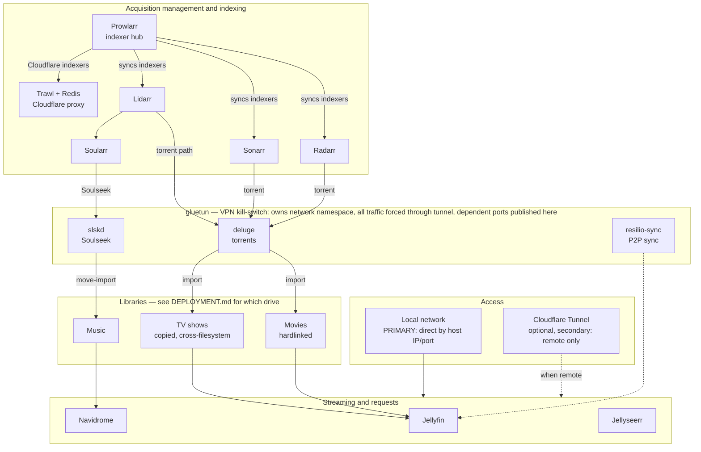

# ARCHITECTURE.md — Media Server System Design

> **What this is:** the shape of the system, how data flows, and *why* the key structural choices were made. This doc is **drive-agnostic** — it describes mount *relationships* and filesystem *boundaries*, not which physical disk anything sits on. Hardware specifics and this-install choices live in `DEPLOYMENT.md`; non-obvious constraints and traps live in `GOTCHAS.md`.
>
> **Platform:** ZimaOS (CasaOS-based). Apps are deployed as Docker Compose stacks managed through the ZimaOS dashboard; the real compose files live at `/DATA/.casaos/apps/<app>/docker-compose.yml`.

---

## 1. What the system does

A self-hosted media acquisition + streaming stack. Three roles:

1. **Acquire** media automatically — movies and TV via torrents, music via Soulseek — driven by "wanted" lists.
2. **Stream** it — video (Jellyfin) and music (Navidrome), reachable remotely without a VPN client.
3. **Isolate** all acquisition traffic behind a VPN kill-switch so nothing leaks to the ISP.

## System diagram



**Reading the diagram:** primary access is on the local network (direct to each service by host IP/port); the Cloudflare Tunnel is an optional secondary path used only when remote. Everything inside the **gluetun** box is VPN-isolated by construction (it has no network of its own). Prowlarr is the indexing hub feeding all three *arr apps. Note the two music paths into Lidarr (Soularr/Soulseek *and* Lidarr's own torrent search) — a delay profile makes Soulseek the preferred path and torrents the fallback, as described below. Movies and music hardlink (same filesystem as downloads); TV copies (library on a different filesystem) — see `GOTCHAS.md` and `DEPLOYMENT.md`.

## 2. Service inventory

| Service | Role |
|---|---|
| **gluetun** | VPN client (WireGuard). Owns the network namespace the download stack rides on. |
| **deluge** | Torrent client. VPN-routed. |
| **slskd** | Soulseek client. VPN-routed. |
| **resilio-sync** | P2P sync (single-purpose: a specific restoration project). VPN-routed. |
| **prowlarr** | Indexer aggregator — one place to manage indexers, syncs them to the *arr apps. |
| **trawl** (+ **trawl-redis**) | Cloudflare/Turnstile solver (FlareSolverr-compatible), used as Prowlarr's indexer proxy for Cloudflare-protected indexers. Redis is its session cache. |
| **radarr** | Movies — acquisition + library management. |
| **sonarr** | TV — acquisition + library management. |
| **lidarr** | Music — library management + wanted list. |
| **soularr** | Bridges Lidarr's wanted list to slskd (searches Soulseek, triggers Lidarr imports). |
| **jellyfin** | Video streaming server. |
| **navidrome** | Music streaming server (Subsonic-compatible). |
| **jellyseerr** | Request front-end for Jellyfin. |
| **cloudflared** | Cloudflare Tunnel — public HTTPS access to the streaming services. |
| **portainer** | Container management UI. |

## 3. The VPN-isolated download stack

`gluetun` owns a network namespace. `deluge`, `slskd`, and `resilio-sync` attach with `network_mode: service:gluetun`, so **all their traffic — in and out — is forced through the VPN tunnel**. They have no network stack of their own, making this a kill-switch **by construction** (it cannot silently fail open).

```
                 ┌──────────────────────────────┐
                 │   gluetun  (VPN, WireGuard)   │
                 │  owns the network namespace   │
                 │  ALL dependent ports are      │
                 │  published HERE, not on the   │
                 │  dependents                   │
                 └────┬─────────┬─────────┬──────┘
             network_mode: service:gluetun
                      │         │         │
                 ┌────▼───┐ ┌───▼───┐ ┌───▼─────────┐
                 │ deluge │ │ slskd │ │ resilio-sync│
                 └────────┘ └───────┘ └─────────────┘
```

**Key architectural consequence:** a service on `network_mode: service:gluetun` **cannot declare its own `ports:` or `hostname:`** — those must live on the gluetun service. (See `GOTCHAS.md`.) Everything else (Prowlarr, the *arr apps, streaming, trawl) runs on normal bridge networking, *not* through the VPN.

## 4. Acquisition pipelines

Two independent content paths, both indexed by Prowlarr:

```
Movies:  Radarr ─┐
                 ├─▶ Prowlarr (indexers) ─▶ deluge (torrent, VPN) ─▶ downloads ─▶ movies library
TV:      Sonarr ─┘

Music:   Lidarr ─┬─▶ Soularr ─▶ slskd (Soulseek, VPN) ─▶ downloads ─▶ music library
                 └─▶ Prowlarr indexers ─▶ deluge (torrent, VPN) ─▶ downloads ─▶ music library
```

- **Prowlarr is the hub.** Indexers are configured once in Prowlarr and synced down to Radarr/Sonarr/Lidarr. For Cloudflare-protected indexers, Prowlarr routes through **Trawl** (its indexer proxy) to solve challenges.
- **Movies/TV are torrent-only** via deluge.
- **Music has two paths, Soulseek preferred and torrents a genuine fallback — not a race.** A Lidarr torrent delay profile holds a candidate release for a fixed window; Soularr's polling interval fires within that window, and if Soulseek satisfies the album first it stops being wanted, so the torrent grab never happens. Only albums Soulseek can't find fall through to Lidarr's own torrent indexers → deluge. (This used to race with no primary/fallback ordering; the delay profile is what changed that — see `DEPLOYMENT.md` for the current delay value.)
- **Soularr** is a separate script (not a server): it reads Lidarr's wanted albums, searches Soulseek via slskd, downloads a pick, renames the folder to `Artist - Album (Year)`, and tells Lidarr to import via a same-mount move. Its text-based matching is the pipeline's weakest link (see `GOTCHAS.md` — wrong-artist grabs; Lidarr's fingerprinting is the guard that catches them).

## 5. Storage architecture (the important part — stated as relationships, not drives)

The system cares about **which mounts share a filesystem**, because that determines whether imports **hardlink** (no extra space) or **copy** (duplication).

### The hardlink requirement
- **For an *arr app to hardlink on import, the download folder and the library folder must be on the same filesystem AND reachable through a mount structure the container sees as one device.**
- The subtle trap: two **separate bind mounts** to the same physical drive still look like **different devices** inside the container, defeating hardlinks silently. The fix is a **single shared parent mount** with downloads and library as sub-paths of it.

### The current shape
- **Movies:** downloads and the movie library share one filesystem *and* one parent mount → Radarr **hardlinks**. This is the intended, space-efficient design.
- **TV:** the TV library is on a **different filesystem** from TV downloads (a capacity-driven deployment choice — see `DEPLOYMENT.md`) → Sonarr **copies**. Mitigated by removing the download after successful import so duplication is transient, not permanent. This is an accepted compromise, revisited when storage grows.
- **Music:** downloads, the Soulseek folder, and the music library were consolidated under one shared parent mount, the same pattern as movies → Lidarr **hardlinks** torrent-sourced imports. Soularr's Soulseek imports still use a **move-based** import (not hardlink), but because that move now stays on one filesystem it's a plain rename rather than a cross-mount copy. With hardlinking in place, a seeded torrent's completed copy shares an inode with the library copy and costs no extra space, so "remove completed" is no longer needed for space reasons on this path (see `DEPLOYMENT.md`).

### Mount-sharing is load-bearing
Several containers mount the **same** download/library folders (e.g. a downloads folder is visible to the torrent client, both relevant *arr apps, and the media server; a media library is visible to its *arr app and the media server). **Relocating any shared folder requires updating the `source:` path in every service that mounts it**, or the others silently point at nothing. (See `GOTCHAS.md`.)

## 6. Cross-service communication

- **App-to-app calls use the host's LAN IP + published port**, not `localhost` (which inside a container means the container itself) and not container names (which only resolve on a shared user-defined network — the apps are on separate bridge networks). This hardcoded-IP dependency is the main **portability caveat** for a rebuild on different hardware. (See `GOTCHAS.md`.)
- **Prowlarr → *arr apps:** Prowlarr pushes indexer config to each app via API (each app's API key is registered in Prowlarr). Set up indexers once in Prowlarr, not per-app.
- **Prowlarr → Trawl:** the proxy targets Trawl by **host IP + port**, so the container behind that port can be swapped without reconfiguring Prowlarr.
- ***arr apps → deluge:** configured as a download client (host IP + port).
- **Trawl → Redis:** by container name via a Docker `links:` entry (a workaround for the platform forcing plain-bridge networking, which lacks name DNS — see `GOTCHAS.md`).

## 7. Access (local-first)

- **Primary access is on the local network** — services are reached directly by host IP + port (e.g. Jellyfin at `<host-ip>:8097`, Navidrome at `<host-ip>:4533`). Day-to-day use is on-network.
- **Cloudflare Tunnel** (`cloudflared`, host network) is an **optional secondary path for remote access only** — it exposes the streaming services (Jellyfin, Navidrome, Jellyseerr) as public HTTPS subdomains reachable from off-network with no VPN client. Convenient when away, but not the main entry point. Note Cloudflare terminates TLS at its edge (a privacy trade-off worth being aware of for anything exposed this way).

## 8. Identity / permissions model

- **All acquisition/library containers run as the same UID/GID** so file ownership is consistent across the pipeline (downloads written by one app must be readable/movable/deletable by the next). This is a hard requirement — mismatched UID/GID causes silent import failures. Implementation details and the per-image quirks are in `GOTCHAS.md`.

## 9. Configuration lives in three tiers (important for backup/rebuild)

1. **Compose files** — what containers exist and how they're wired to disk/network. Plain text, version-controllable.
2. **App databases** — everything configured in the UIs (indexers, download clients, root folders, quality profiles, connections). Stored in each app's SQLite DB under its config dir. Restorable, but contains machine-specific values (IPs, API keys, absolute paths) that need fixup on different hardware.
3. **Integration knowledge** — the cross-app requirements, correct settings, and gotchas that aren't in *any* file (UID/GID, the gluetun namespace rules, hardlink/filesystem constraints, Soularr tuning, etc.). Captured in `GOTCHAS.md` — for a rebuild on new hardware this is often *more* valuable than the databases, since the DBs carry the old machine's specifics.
